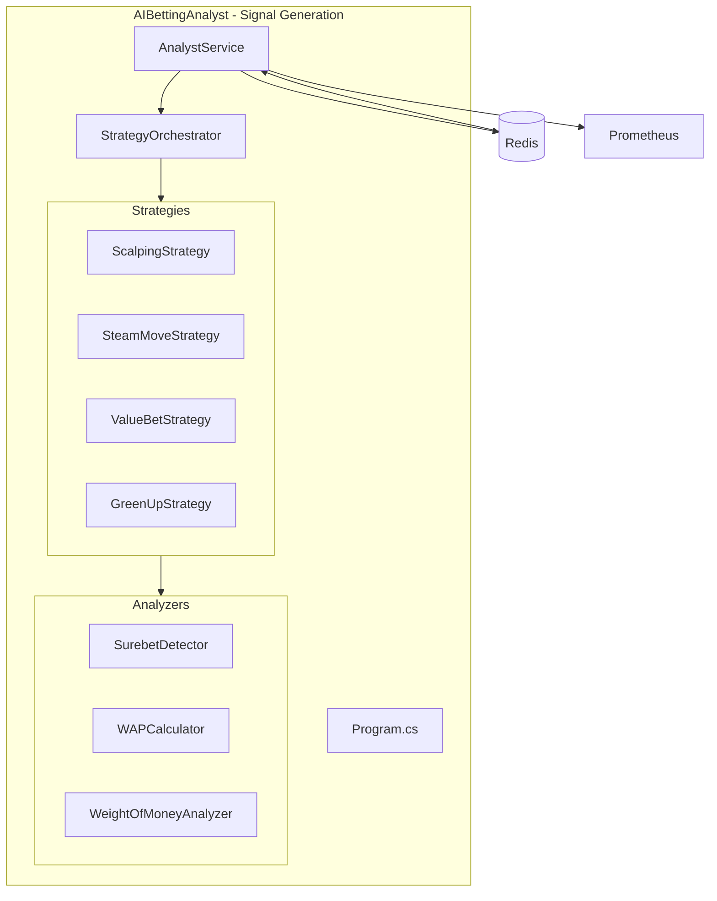
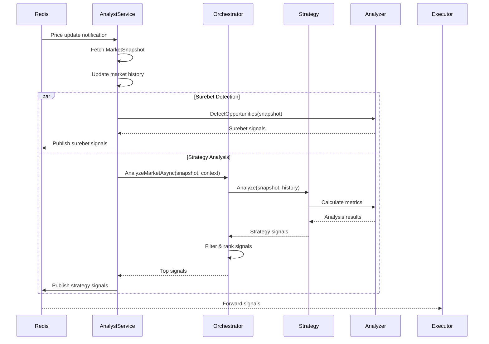
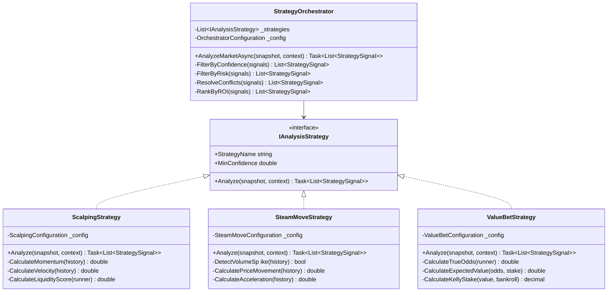
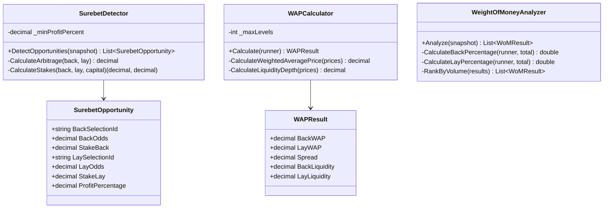
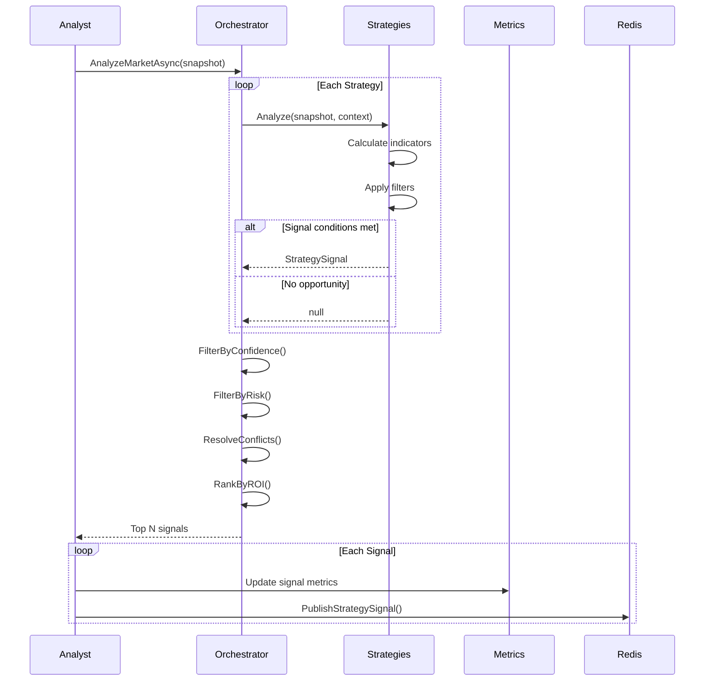
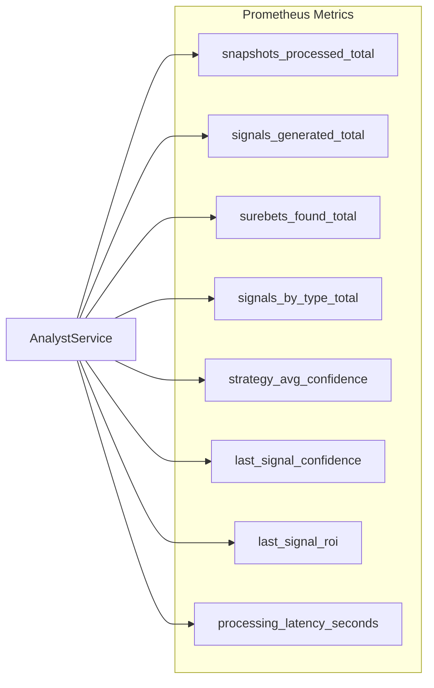
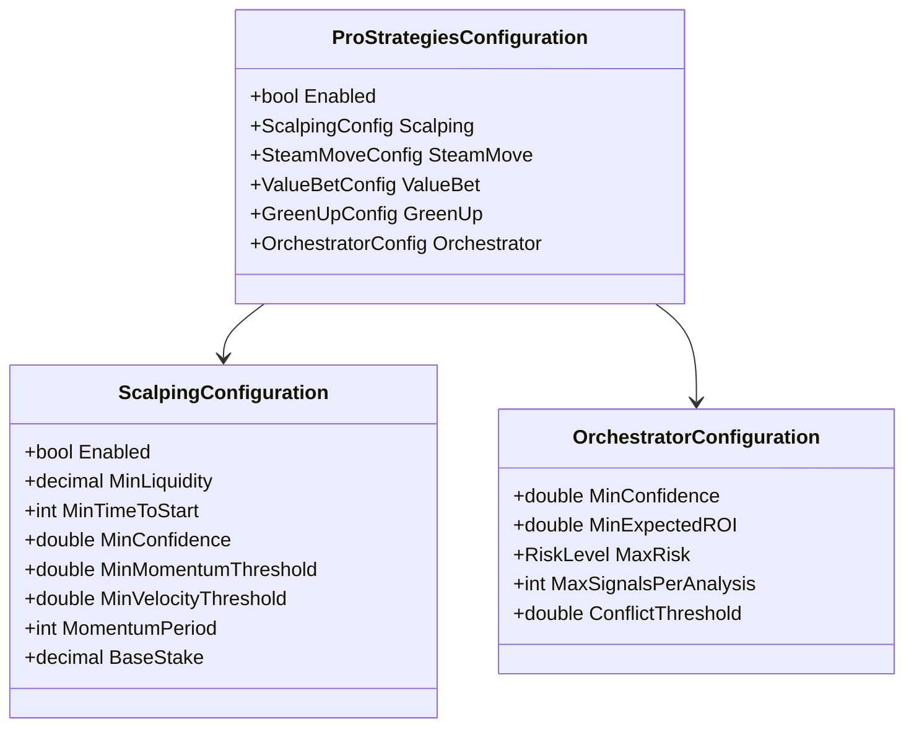
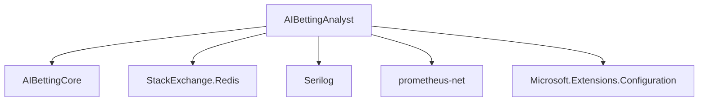

# AIBettingAnalyst - Class Diagrams

## Architecture Overview

## Main Analysis Flow

## Strategy Orchestrator Pattern

## Analyzers

## Signal Generation Flow

## Metrics Tracking

## Configuration Structure

## Key Features

### 1. **Multi-Strategy Analysis**
- Parallel strategy execution
- Configurable strategy weights
- Conflict resolution

### 2. **Market Analysis**
- Surebet detection
- WAP calculation
- Weight of Money analysis
- Historical trend analysis

### 3. **Signal Quality**
- Confidence scoring
- ROI estimation
- Risk level classification
- Signal validation

### 4. **Performance**
- Efficient market history tracking
- Limited depth (15 snapshots)
- Minimal latency
- Prometheus metrics export

## Dependencies

