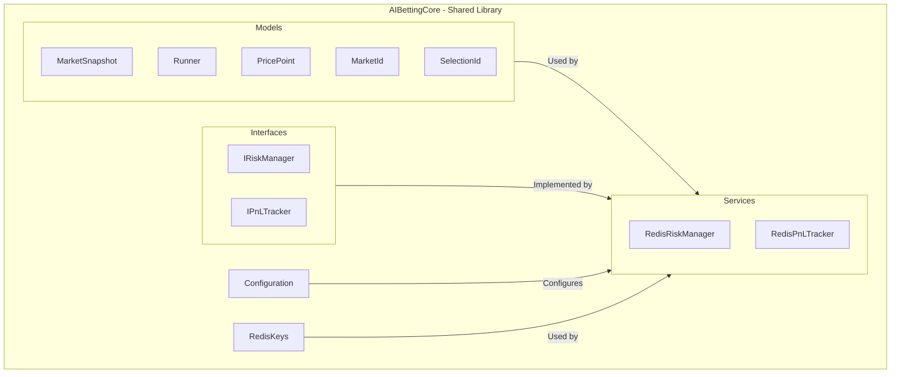
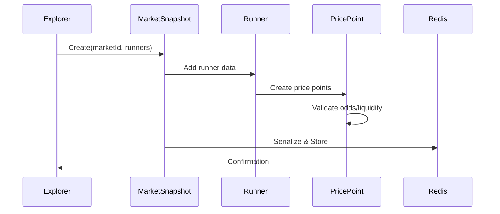
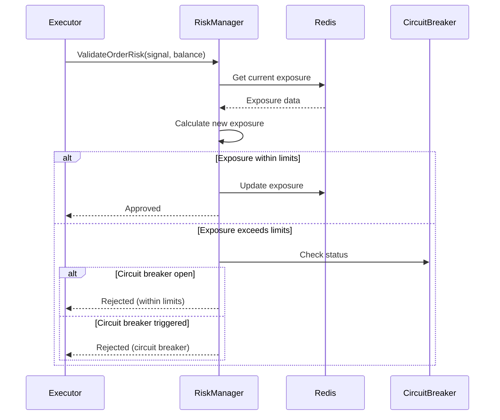
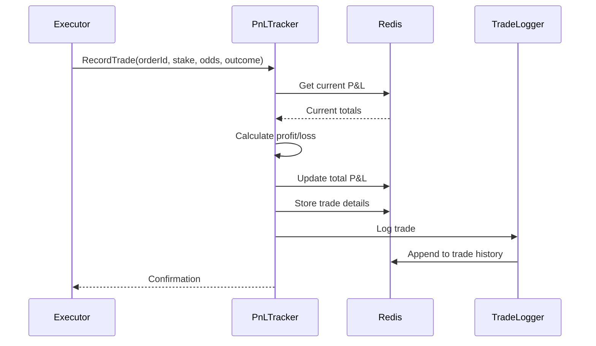
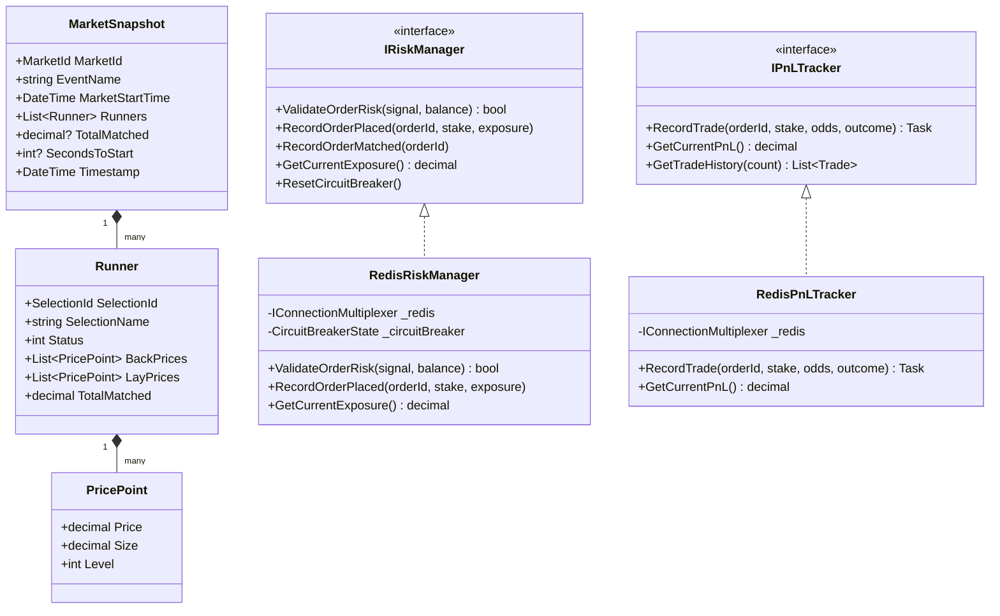
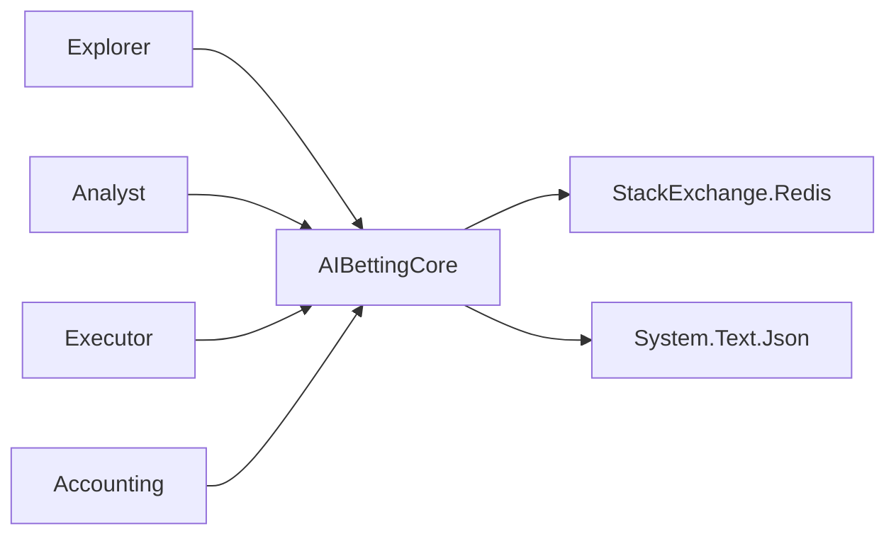

# AIBettingCore - Class Diagrams

## Architecture Overview



## Core Models Sequence



## RedisRiskManager Flow



## RedisPnLTracker Flow



## Class Hierarchy



## Key Patterns

### 1. **Value Objects**
- `MarketId`, `SelectionId` - Immutable identifiers with validation
- `PricePoint` - Immutable price/liquidity pair

### 2. **Repository Pattern**
- `RedisRiskManager` - Risk data storage/retrieval
- `RedisPnLTracker` - P&L persistence

### 3. **Domain Services**
- Risk validation logic
- P&L calculation logic
- Circuit breaker state management

## Redis Key Structure

```
# Risk Management
risk:exposure:{marketId}           → Current exposure per market
risk:exposure:selection:{selId}    → Exposure per selection
risk:daily-loss                    → Cumulative daily loss
risk:circuit-breaker               → Circuit breaker state

# P&L Tracking
pnl:total                          → Total cumulative P&L
pnl:daily                          → Daily P&L
pnl:trades:{date}                  → Trade history by date
```

## Dependencies


