# AIBettingExecutor - Class Diagrams

## Architecture Overview

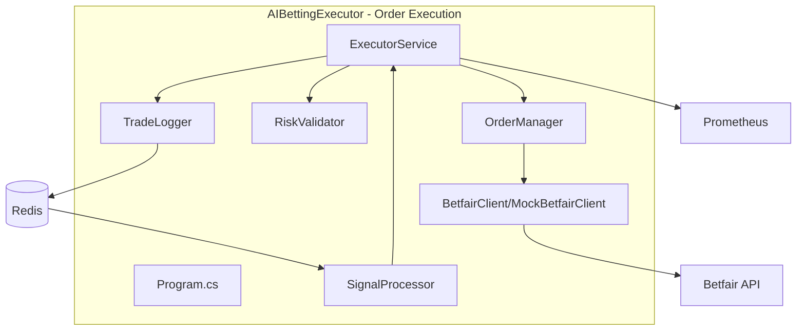

## Main Execution Flow

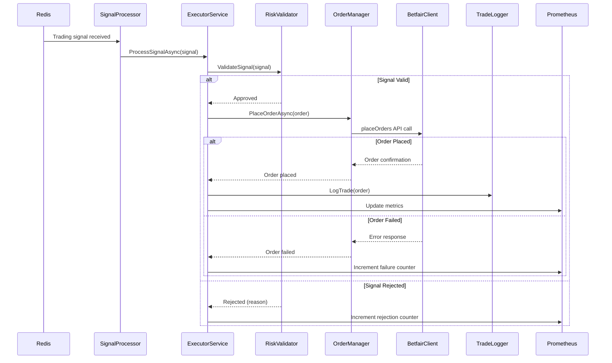

## ExecutorService Class Diagram

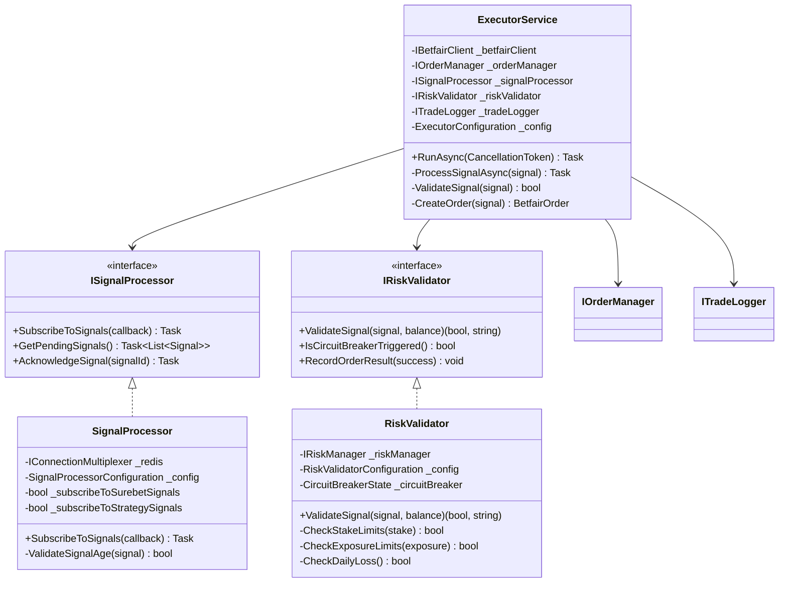

## Order Manager Flow

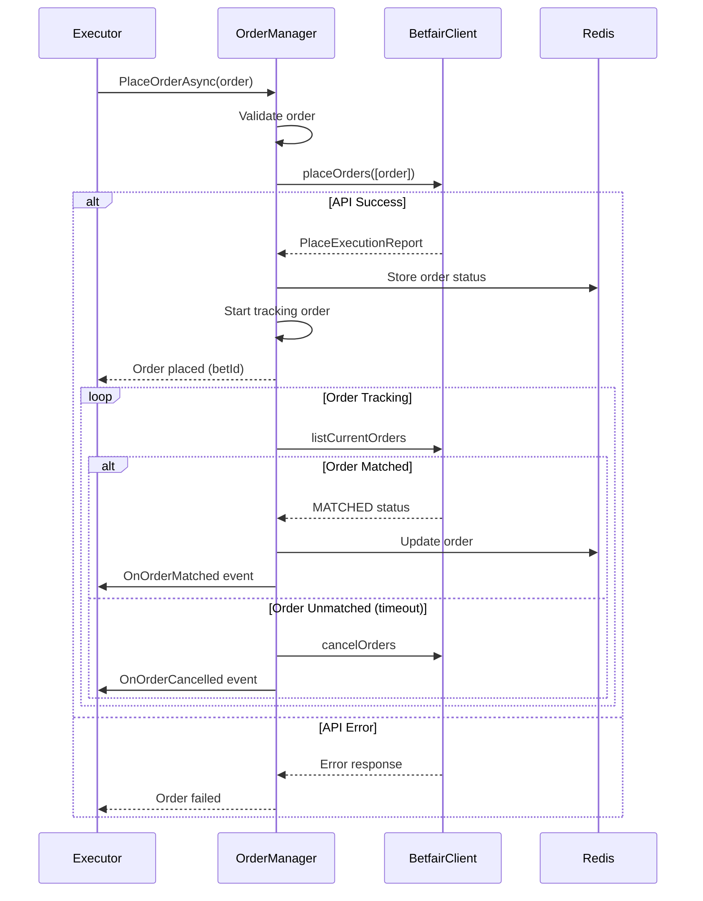

## Risk Validation Flow

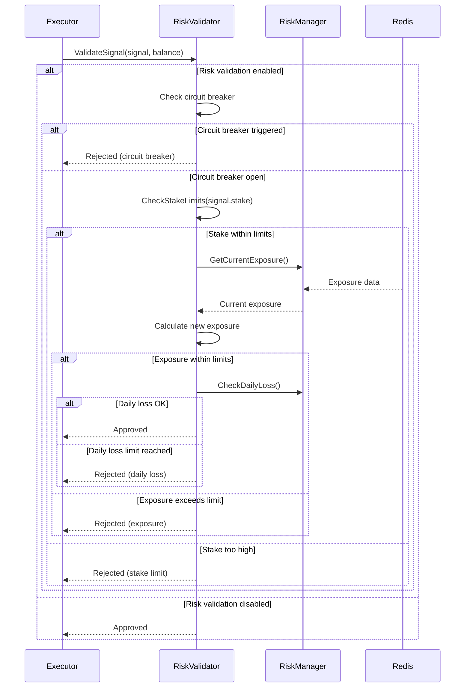

## Circuit Breaker Pattern

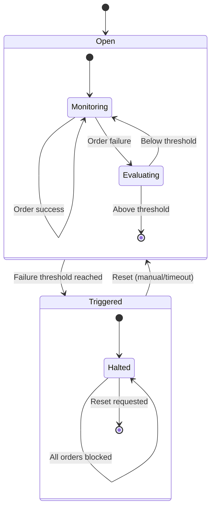

## Trade Logger

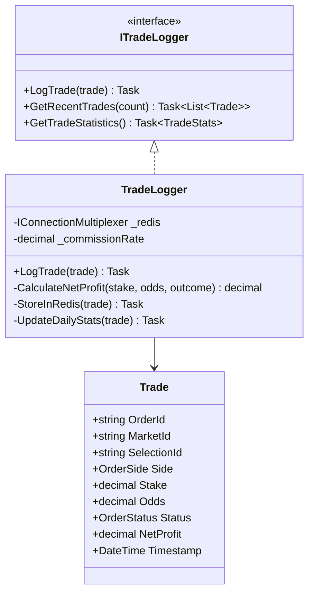

## Betfair Client Abstraction

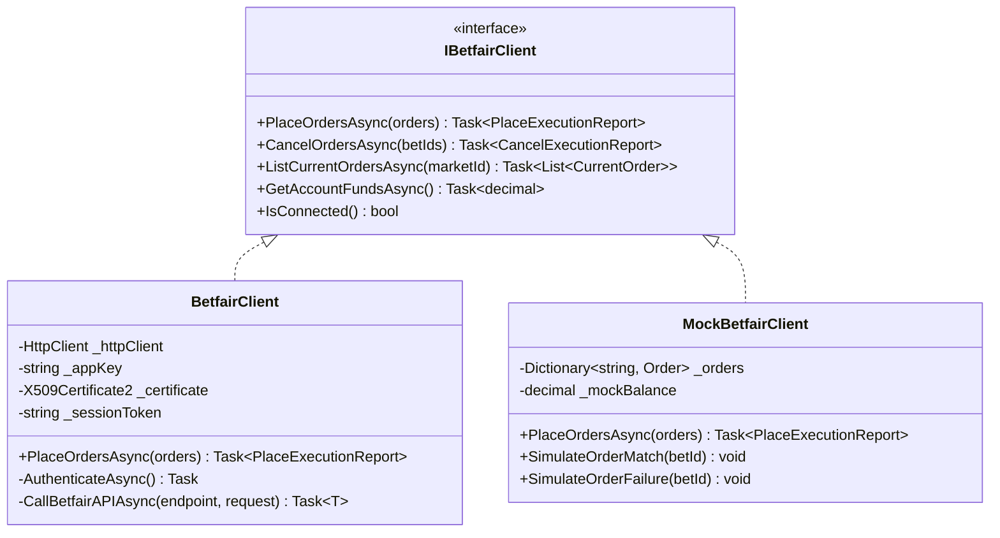

## Metrics Export

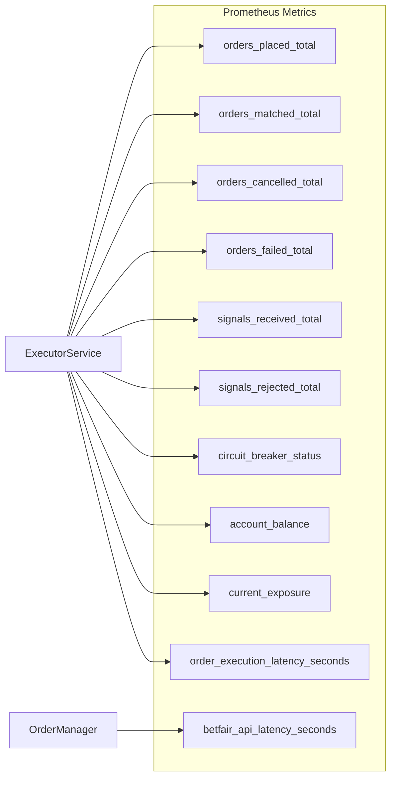

## Configuration

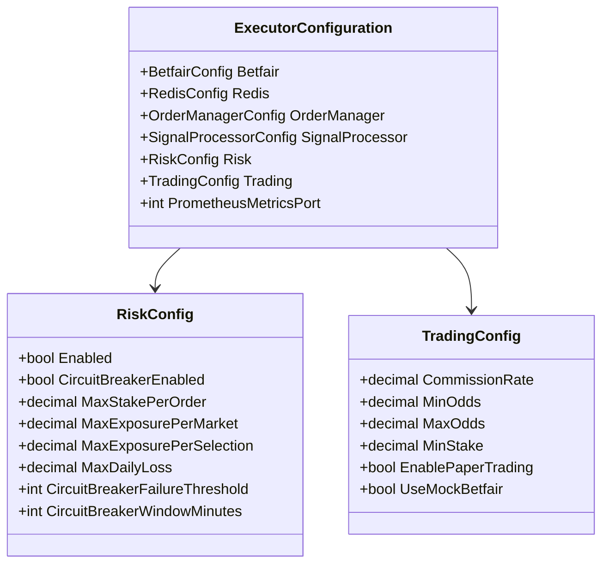

## Key Features

### 1. **Risk Management**
- Multi-level validation (stake, exposure, daily loss)
- Circuit breaker pattern
- Configurable limits
- Real-time exposure tracking

### 2. **Order Management**
- Automated order placement
- Order status tracking
- Timeout handling
- Cancellation support

### 3. **Dual Mode Operation**
- Production mode (real Betfair API)
- Mock mode (testing without real trades)
- Paper trading support

### 4. **Observability**
- Comprehensive metrics
- Trade logging
- Error tracking
- Performance monitoring

## Dependencies

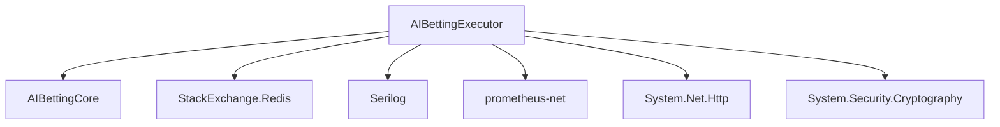
