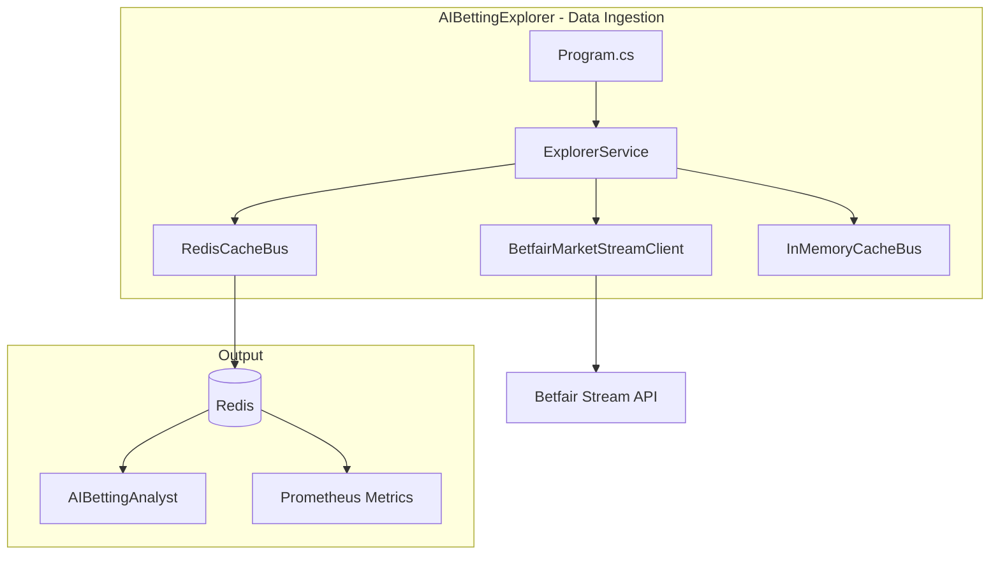
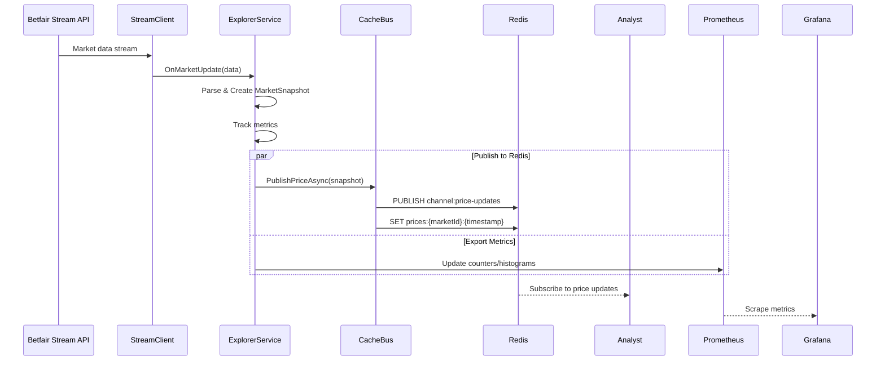
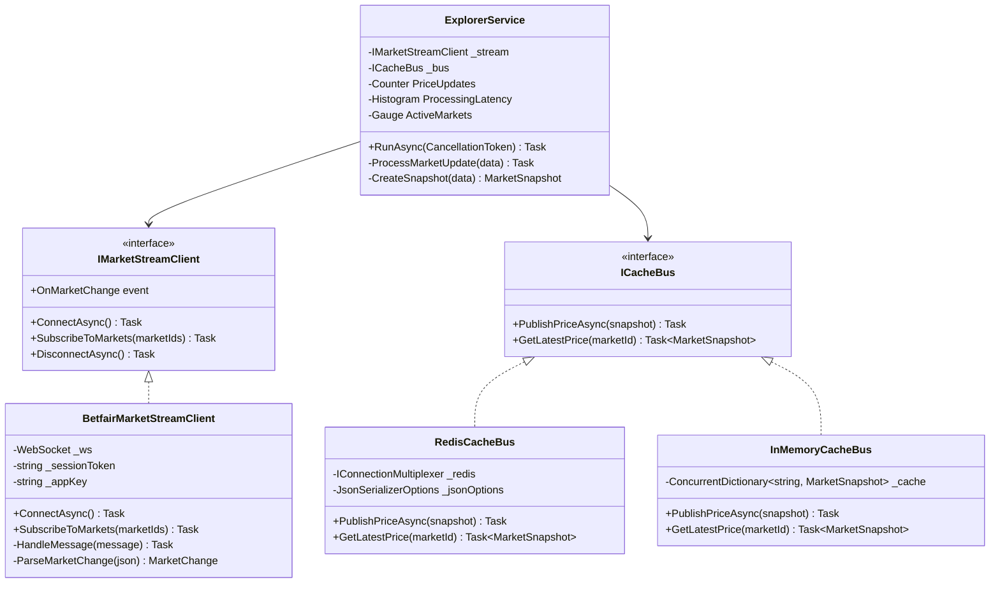
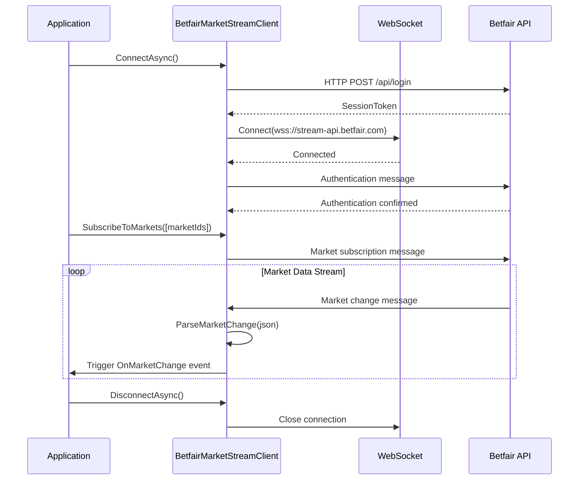
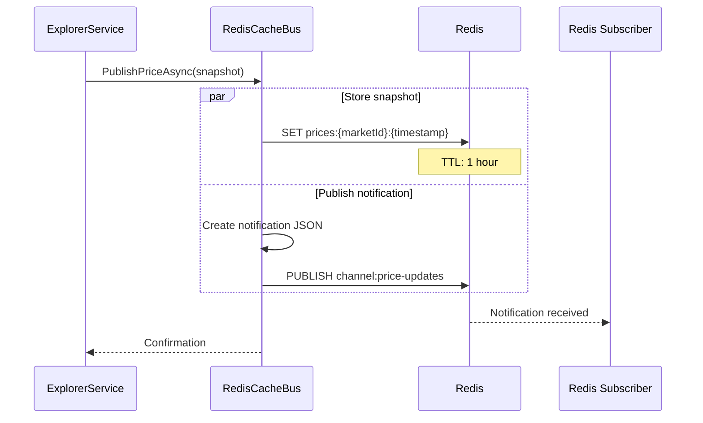
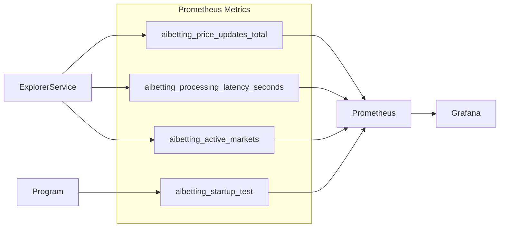
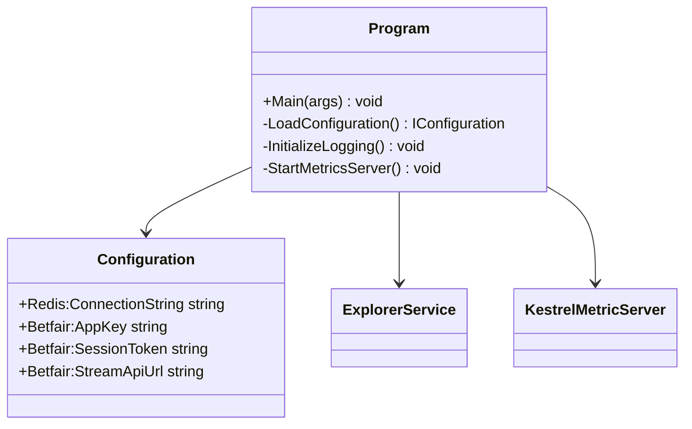
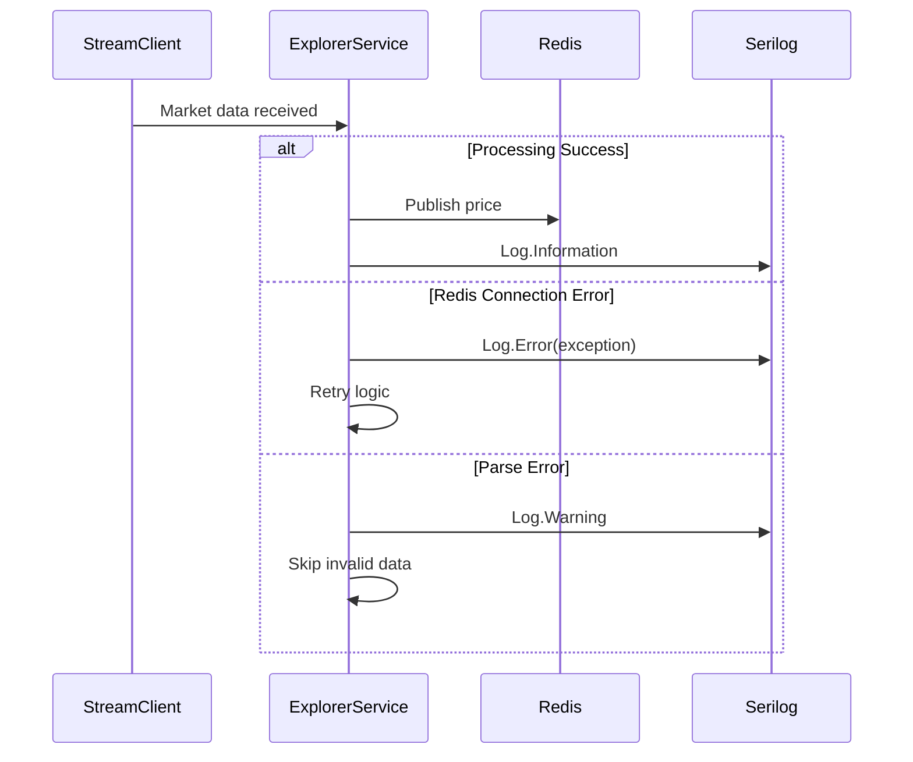
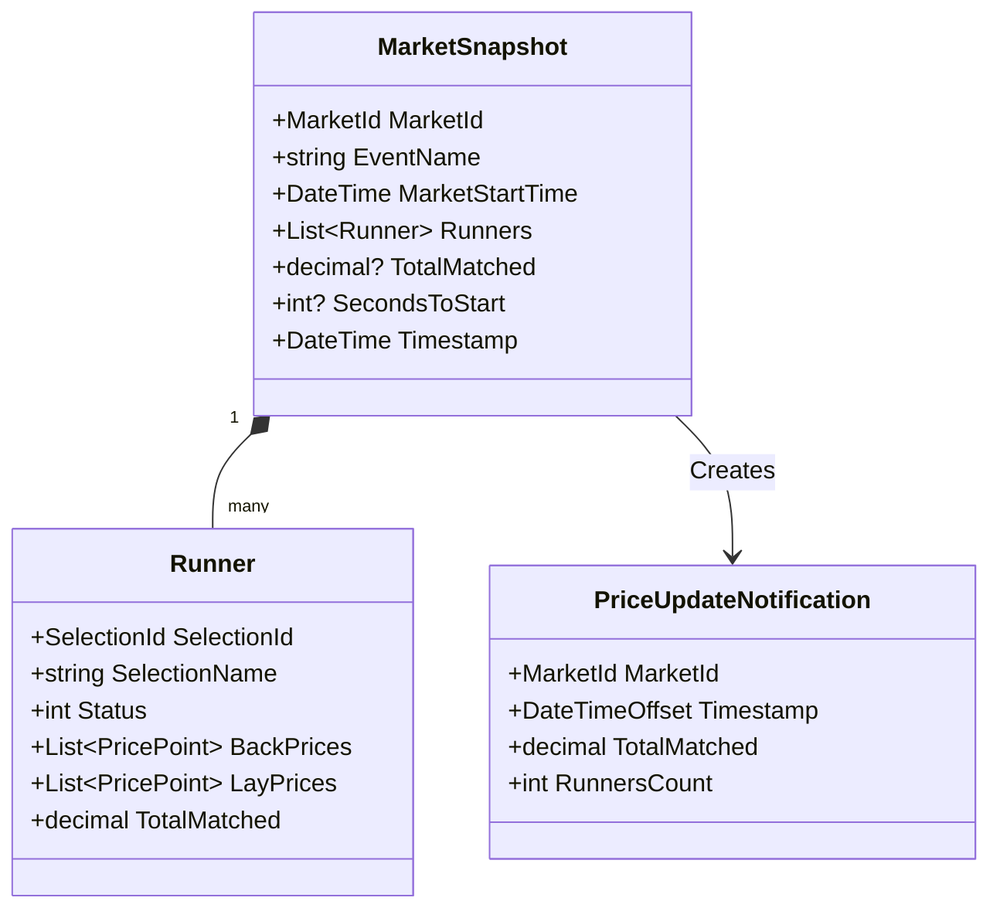
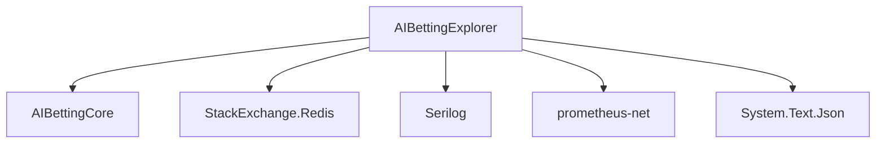

# AIBettingExplorer - Class Diagrams

## Architecture Overview



## Main Data Flow



## ExplorerService Class Diagram



## Betfair Stream Client Flow



## RedisCacheBus Implementation



## Metrics Tracking



## Configuration



## Error Handling



## Key Features

### 1. **Real-time Stream Processing**
- WebSocket connection to Betfair
- Event-driven market data handling
- Low-latency price updates

### 2. **Dual Cache Strategy**
- Redis for distributed caching
- In-memory fallback option
- TTL-based expiration

### 3. **Observability**
- Structured logging (Serilog)
- Prometheus metrics export
- Health check endpoint

### 4. **Resilience**
- Automatic reconnection
- Error recovery
- Graceful shutdown

## Data Model



## Deployment

```
Explorer (Port 5001)
├── /metrics → Prometheus metrics endpoint
├── Redis Connection → localhost:16379
└── Betfair Stream → wss://stream-api.betfair.com
```

## Dependencies


